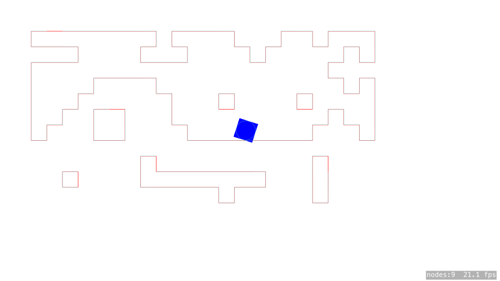

# spritekit-level-generator-moore-neighborhood
Generates a SKShapeNode/PhysicsBody based .txt file using Moore Neighborhood Contour Tracing algorithm

### Example

On your `gamescene.swift` add:
```swift
let lvlGen = MooreLevelGenerator();
lvlGen.loadLevel(self)
```
It will load the `Level.txt`file:

```txt
111111111111111111111111
100000000100001110010001
111100001110000100000101
100000000000000000001111
100001111000000000000101
100011111100010000100001
100110011100000000001001
101110011110000000011101
111111111111111111111111
111111110111111111101111
111011110000000011101111
111111111111101111101111
111111111111111111111111
```
And generate this SKShapeNode with the correct physicsBody:

